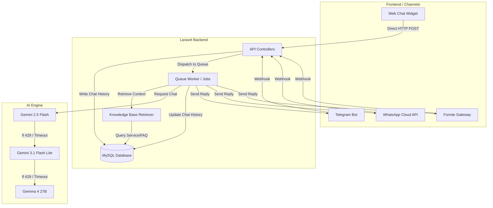
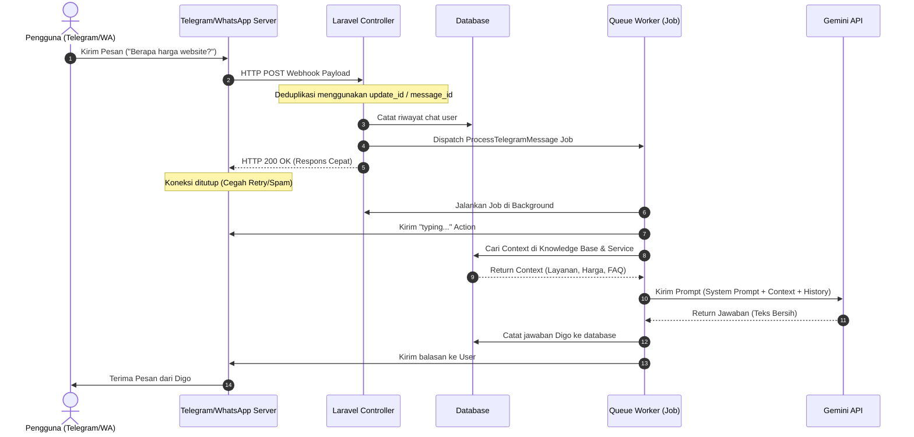

# Sistem Arsitektur AI Sales Assistant

Dokumen ini menjelaskan alur data, arsitektur teknis, dan mekanisme penanganan beban (rate limiting & fallback) dari sistem chatbot Digo.

---

## 🏗️ Alur Komunikasi Sistem

Sistem mendukung tiga gerbang masuk (Web Chat, Telegram Bot, dan WhatsApp Gateway) yang semuanya dilayani oleh satu backend Laravel yang terpusat.

---

## 🔄 Alur Kerja Pemrosesan Pesan (Asinkron)

Untuk mencegah timeout pada WhatsApp dan Telegram Bot, pemrosesan AI dijalankan secara asinkron menggunakan Laravel Queue Worker.

---

## 🧠 Sistem Auto-Fallback Gemini

Untuk mengatasi limit kuota harian (Requests Per Day - RPD) pada Google AI Studio Free Tier, `GeminiService` menggunakan mekanisme **Fallback Chain** otomatis menggunakan Cache Driver:

1. **Model Utama (Primary):** `gemini-2.5-flash` (kualitas terbaik, 20 RPD).
2. **Fallback Pertama:** `gemini-3.1-flash-lite` (500 RPD).
3. **Fallback Kedua:** `gemma-4-27b-it` (1500 RPD).

### Mekanisme Cooldown
Jika sebuah model mengembalikan kode status HTTP `429` (Rate Limited) atau `503` (Service Unavailable):
1. Sistem menandai model tersebut di Cache dengan status `cooldown` selama **1 jam**.
2. Sistem secara otomatis berpindah ke model fallback berikutnya untuk melayani request saat ini.
3. Selama masa cooldown aktif, model tersebut akan dilewati (skipped) saat ada chat baru masuk.
